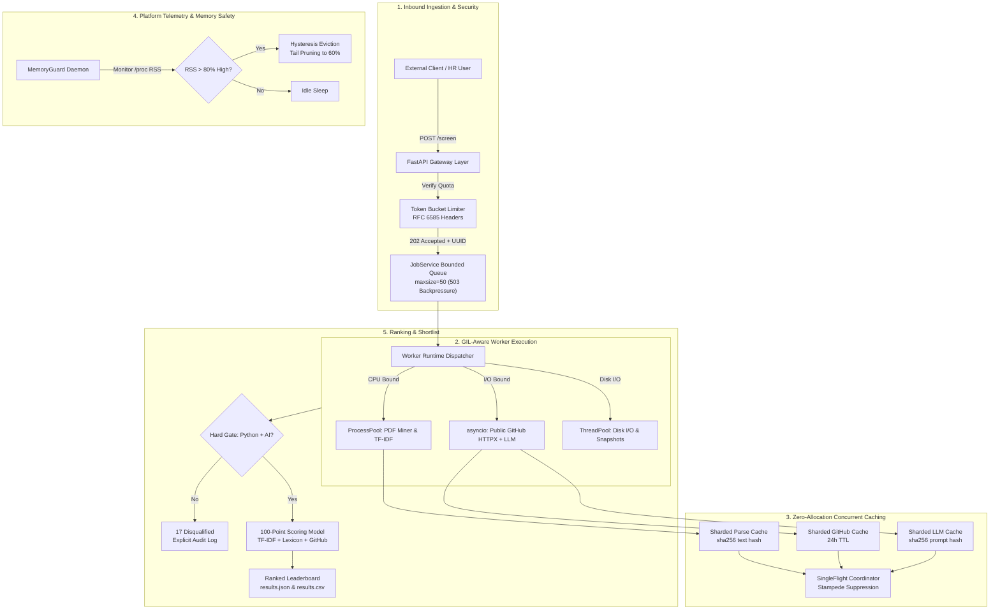

<div align="center">

# 🚀 AI Resume Screening & Ranking Platform
### Built for Kasparro · SDE / AI Platform Engineering

[](https://python.org)
[](https://fastapi.tiangolo.com)
[](https://pydantic.dev)
[-brightgreen?style=for-the-badge&logo=pytest&logoColor=white)](tests/)
[](tests/)
[](.github/workflows/ci.yml)
[](SUBMISSION.md)

<p align="center">
  <b>A production-grade, explainable hiring intelligence service</b><br>
  Ingests multi-format resumes → Enforces deterministic Python & AI eligibility gates → Computes 100-point depth scores → Enriches with public GitHub activity → Serves via concurrent, memory-bounded, rate-limited FastAPI & CLI.
</p>

[Quickstart](#-quickstart-in-under-2-minutes) • [Architecture](#-architecture--doctrine) • [Dual Deliverables](#-dual-deliverables-repository-structure) • [Scoring Model](#-100-point-candidate-scoring-rubric) • [API & Swagger UI](#-api-specification--interactive-swagger-ui) • [Reviewer Guide](SUBMISSION.md) • [Usage Guide](USAGE_GUIDE.md)

</div>

---

### 📊 Benchmark & Screening Summary (50 Candidate Resumes)

| Metric | Result | Engineering Invariant |
|---|---|---|
| **Total Resumes Ingested** | **50 files** (`.pdf`, `.docx`, `.txt`) | Multi-format parsing with failure isolation |
| **Batch Runtime** | **~10.2 seconds** | CPU/IO GIL-aware multiprocessing execution |
| **Eligible Shortlist** | **33 candidates** | Verified Python skills + AI/agentic project depth |
| **Disqualified Candidates** | **17 candidates** | Audited with explicit, human-readable rejection reasons |
| **Automated Test Suite** | **85 / 85 tests (100% green)** | Unit, 32-thread Concurrency, Property (Hypothesis), Golden Parity |
| **External Dependencies** | **Zero Redis / Zero Postgres** | Pure Python standard library first, fail-closed architecture |

---

## 🏛️ Architecture & Doctrine

> ### ⚖️ Core Doctrine: *"LLM as Witness, Code as Judge"*
> **LLMs are stochastic; hiring criteria must be deterministic and auditable.**  
> - **Eligibility & Scoring** are executed in pure, deterministic Python. Models are never allowed to hallucinate a candidate into passing.
> - **LLM Integration** acts purely as an advisory witness providing structured evidence validated against strict Pydantic schemas (`LLMJudgement`).
> - **Anti-Hallucination Guard**: Every claim made by an LLM is verified against a verbatim quote ($\le 25$ words) extracted from the resume. Unsubstantiated claims are automatically dropped.



---

## 📦 Dual-Deliverables Repository Structure

To satisfy both a **lightweight, immediate take-home review (< 5 min setup)** and an **advanced enterprise platform engineering showcase**:

```
ResumeScreening/
├── submission/                    # 🎯 LEAN REVIEWER PACKAGE (< 5 min setup)
│   ├── main.py                    # Standalone synchronous CLI runner
│   ├── api.py                     # Minimal FastAPI wrapper (POST /screen, GET /results)
│   ├── src/screener/              # Pure domain logic (zero platform bloat)
│   ├── tests/                     # 16 focused domain & pipeline tests
│   ├── results.json               # Pre-computed golden run for all 50 resumes
│   └── README.md                  # Quickstart guide for lean reviewer
│
├── src/screener/                  # 🏢 ENTERPRISE PLATFORM SHOWCASE
│   ├── core/                      # Standard-library concurrency & memory primitives
│   │   ├── lru_cache.py           # O(1) DLL + HashMap LRU & Segmented LRU (SLRU)
│   │   ├── sharded_cache.py       # 16-shard lock striping for high concurrency
│   │   ├── single_flight.py       # Lock-free cache stampede suppression
│   │   ├── memory_guard.py        # Cross-platform RSS monitoring & hysteresis eviction
│   │   └── rate_limiter.py        # Token Bucket & Leaky Bucket with RFC headers
│   ├── services/                  # Multiprocessing dispatch & bounded job queues
│   │   ├── workers.py             # ProcessPool + ThreadPool + AsyncIO runtime
│   │   └── job_service.py         # Async job queue with backpressure (503)
│   └── api/                       # Production FastAPI app with Swagger UI guide
│
├── main.py                        # Root enterprise CLI entrypoint
├── api.py                         # Root enterprise FastAPI entrypoint
├── SUBMISSION.md                  # Comprehensive reviewer defense & rubric mapping
├── USAGE_GUIDE.md                 # Complete dual usage guide (Candidate & Reviewer)
├── docs/DEFENSE.md                # Interview defense guide (7 core architectural choices)
└── results.json                   # Verified pre-screened dataset
```

---

## ⚡ Quickstart (In Under 2 Minutes)

### 1. Setup Environment
```bash
# Clone and enter repo
git clone https://github.com/SVSS13/ResumeScreening.git
cd ResumeScreening

# Create virtual environment and install dependencies
python3 -m venv venv
source venv/bin/activate
pip install -r requirements.txt
```

### 2. Method A: CLI Screening (Primary Evaluation)
Run the screening pipeline on the 50 candidate resumes:
```bash
python3 main.py --input ./resumes --output ./output/results.json
```
*Outputs formatted terminal leaderboard, `output/results.json`, and `output/results.csv`.*

### 3. Method B: FastAPI & Interactive Swagger UI
```bash
python3 -m uvicorn api:app --host 0.0.0.0 --port 8000
```
- Open browser to **`http://localhost:8000/docs`**
- Follow the 3-click workflow:
  1. **`POST /screen`** $\to$ *Execute* (submits batch, returns `202 Accepted` + `job_id`).
  2. **`GET /jobs/{job_id}`** $\to$ *Execute* (monitors progress until `"status": "done"`).
  3. **`GET /results`** $\to$ *Execute* (fetches ranked candidates with complete 100-pt breakdowns and rejection reasons).

### 4. Method C: Automated Test Suite (85 Tests, 100% Green)
```bash
# Run all 85 unit, concurrency, property-based, and benchmark tests
pytest -v

# Run lean submission tests only
pytest submission/tests/
```

### 5. Method D: Security & Vulnerability Auditing
```bash
# 1. Install development & security auditing tools
pip install -r requirements-dev.txt

# 2. Dependency vulnerability audit (CVE scanning via pip-audit)
pip-audit

# 3. Static Application Security Testing (Bandit SAST)
bandit -r src/

# 4. Code quality & formatting check (Ruff)
ruff check .
```

---

## 🎯 100-Point Candidate Scoring Rubric

Directly aligned with the Kasparro AI Platform Engineering specification:

| Dimension | Max Points | Evaluation Signals |
|---|---|---|
| **AI / Agentic / RAG Project Depth** | **40 pts** | Multi-agent coordination (LangGraph/CrewAI), tool calling, RAG pipelines, vector search, embeddings, state machines. |
| **Python & Backend Engineering** | **30 pts** | Python fundamentals, async programming, FastAPI, PostgreSQL, Redis, modular architecture. |
| **Cloud / Deploy / Full Stack** | **15 pts** | Docker containerization, GCP Cloud Run, CI/CD pipelines, React/Next.js supporting signals. |
| **GitHub Activity & Signals** | **10 pts** | Recent public commit frequency (0–5 pts) + relevant maintained repositories (0–5 pts). |
| **Engineering Depth Signals** | **5 pts** | Concurrency safety, custom caching, queues, failure handling, testing habits, observability. |

#### Deductions & Penalties:
- **-10 pts**: Thin API wrappers (calling `openai.ChatCompletion.create` without retrieval, state, or product logic).
- **-5 pts**: Generic tutorial projects lacking evidence of personal ownership.
- **-5 pts**: AI buzzwords appearing only in skills lists without implementation evidence.

---

## 🔒 Security & Secrets Policy

- **No Secrets Committed**: Following production security best practices, no personal API keys or GitHub tokens are hardcoded or committed to git.
- **Zero-Secret Offline Baseline**: By default, the system runs with `LLM_PROVIDER=none`. The entire ingestion, hard filtering, TF-IDF semantic scoring, and ranking pipeline runs 100% locally in pure Python without requiring any external API keys or paid services.
- **Pre-Generated Results**: The pre-computed screening output for all 50 resumes is bundled in [`results.json`](results.json).
- **Optional LLM Scoring**: If you wish to test with an LLM, copy `.env.example` to `.env` and set `LLM_PROVIDER=openai` (or `anthropic`) with your `LLM_API_KEY`.

---

## 📖 Complete Documentation Index

- 📋 [**SUBMISSION.md**](SUBMISSION.md) — Comprehensive assessment submission, design rationale, and rubric alignment.
- 📘 [**USAGE_GUIDE.md**](USAGE_GUIDE.md) — Step-by-step instructions for candidate and reviewer.
- 🛡️ [**docs/DEFENSE.md**](docs/DEFENSE.md) — Architectural interview defense guide (7 core design trade-offs).
- 📐 [**docs/design.md**](docs/design.md) — Low-level engineering design specification and memory models.
- 📑 [**docs/audit.md**](docs/audit.md) — Concurrency and hardening triage log.

---

## 👤 Candidate Information

- **Candidate**: Sujal V S
- **Role**: SDE Intern / AI Platform Engineering
- **Assessment**: AI Resume Screening & Ranking Platform
- **GitHub Repository**: [https://github.com/SVSS13/ResumeScreening](https://github.com/SVSS13/ResumeScreening)
