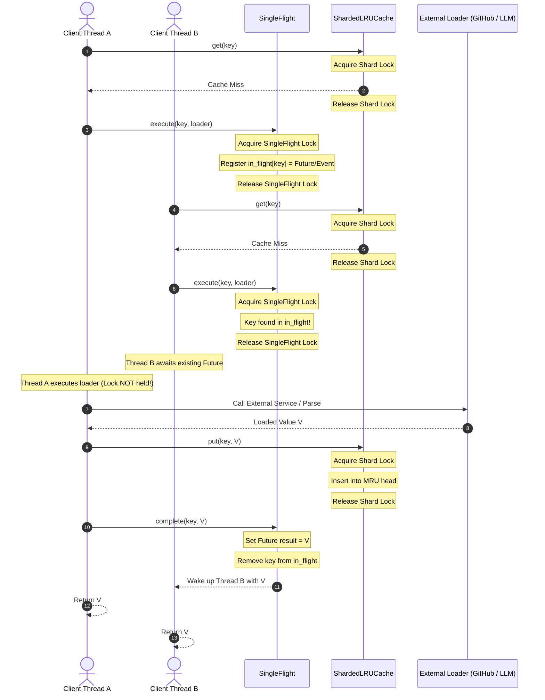
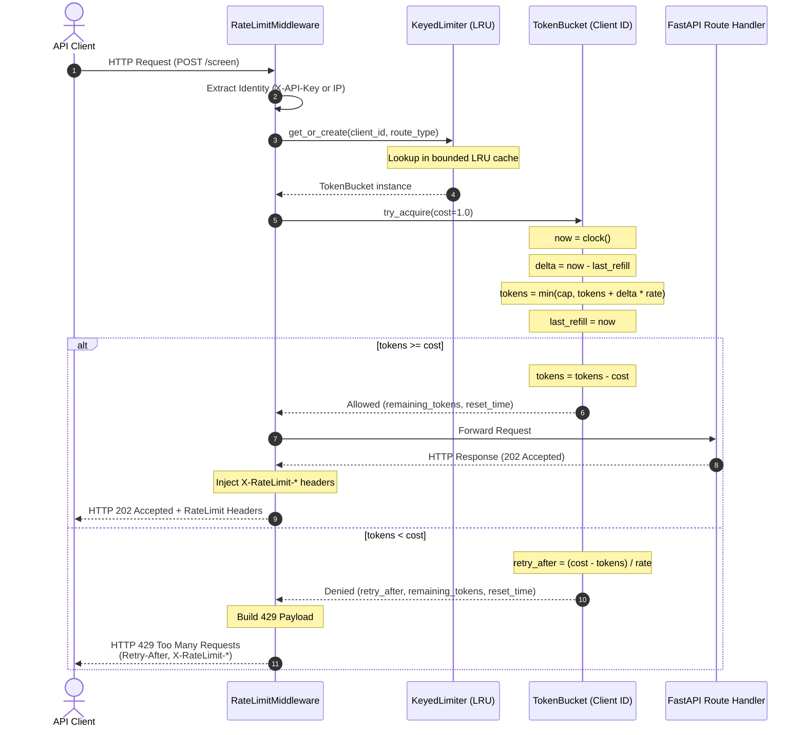
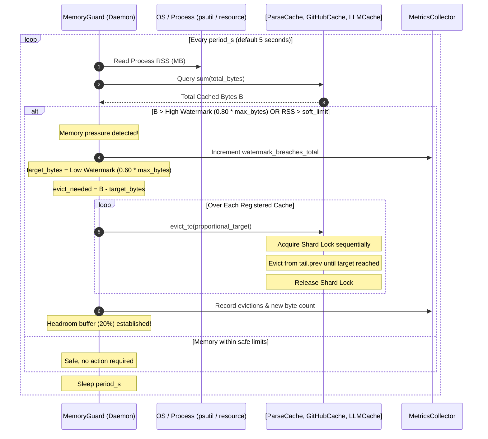

# Phase 2: System Architecture & Technical Design Document

## 1. System Overview

The restructured Resume Screening Backend delivers an asynchronous, concurrent, rate-limited, and memory-bounded pipeline. It enforces strict separation of concerns across layers while preserving the deterministic domain scoring logic without any modifications.

```
                           +------------------------+
                           |  External API Clients  |
                           +-----------+------------+
                                       |
                                HTTP Requests
                                       |
               +-----------------------v-----------------------+
               |                 FastAPI Layer                 |
               |                                               |
               |  +-----------------------------------------+  |
               |  |          RateLimitMiddleware            |  |
               |  |  (Token Bucket per client_id in LRU)    |  |
               |  +--------------------+--------------------+  |
               +-----------------------|-----------------------+
                                       | 202 Accepted (job_id)
               +-----------------------v-----------------------+
               |                  JobService                   |
               |  - Bounded asyncio.Queue (maxsize=50)         |
               |  - Backpressure: 503 + Retry-After if full     |
               |  - Bounded In-Memory Job Store (LRU 1k jobs)  |
               +-----------------------+-----------------------+
                                       |
                                 Worker Runtime
                                       |
       +-------------------------------+-------------------------------+
       |                               |                               |
       v                               v                               v
+--------------------+      +--------------------+      +--------------------+
| ProcessPool (CPU)  |      |   asyncio (I/O)    |      |  ThreadPool (Disk) |
| - PDF/DOCX Parsing |      | - GitHub API       |      | - Disk persistence |
| - Text Extraction  |      | - LLM API Calls    |      | - Atomic snapshots |
| - TF-IDF Matrix    |      |   (httpx async)    |      |   (os.replace)     |
+---------+----------+      +---------+----------+      +---------+----------+
          |                           |                           |
          +-------------+             |             +-------------+
                        |             |             |
+-----------------------v-------------v-------------v------------------------+
|                          ShardedLRUCache Layer                             |
|  - 16 Independent Shards: hash(key) % 16, Lock Striping                    |
|  - Single-Flight Coordinator (Stampede / Thundering-Herd Suppression)       |
|  - Hand-Crafted Doubly Linked List + Hash Map (O(1) get/put/evict)         |
|  - TTL Min-Heap with Version Check & Lazy Expiration                       |
|  - Segmented LRU (SLRU): Probation (20%) + Protected (80%)                |
|                                                                            |
|   [ParseCache]               [GitHubCache]                 [LLMCache]      |
|   key=sha256(content)        key=username, TTL=24h         key=sha256(...) |
+-------------------------------------+--------------------------------------+
                                      |
                         +------------v------------+
                         |       MemoryGuard       |
                         |  (Daemon Thread: 5s)    |
                         |  - RSS + Cache Bytes    |
                         |  - High Watermark (80%) |
                         |  - Low Watermark (60%)  |
                         |  - Hysteresis Eviction  |
                         +-------------------------+
```

---

## 2. Sequence Diagrams (Mermaid)

### 2.1 Single-Flight Cache Lookup and Loader Flow
Prevents cache stampedes when multiple concurrent requests encounter a cache miss on the same key.



---

### 2.2 Token Bucket Inbound Rate Limiting Middleware
Enforces per-client quotas and injects RFC-standard rate limit response headers.



---

### 2.3 Runtime Memory Eviction with Hysteresis (MemoryGuard)
Monitors system RSS and aggregate cache memory, executing batched evictions down to the low watermark to avoid cache thrashing.



---

### 2.4 Graceful Shutdown Sequence
Drains the in-flight job queue and executes atomic cache persistence to prevent corrupt snapshots.

```mermaid
sequenceDiagram
    autonumber
    actor Admin as OS / Docker (SIGTERM / SIGINT)
    participant App as FastAPI Lifespan / App
    participant JS as JobService
    participant Workers as Worker Runtime
    participant Caches as ShardedLRUCache
    participant Disk as Filesystem

    Admin->>App: Send SIGTERM
    Note over App: Trigger shutdown lifecycle hook
    App->>JS: stop_accepting_jobs()
    Note over JS: Ingress closed; new POST /screen returns 503

    App->>JS: drain_queue(timeout=shutdown_timeout_s)
    Note over JS: Wait for actively running jobs to complete
    JS->>Workers: join_active_tasks()
    Workers-->>JS: All active tasks finished

    App->>Caches: snapshot_to_disk()
    Note over Caches: Serialize state to temporary file (cache.json.tmp)
    Caches->>Disk: write_text(json_data) + fsync()
    Note over Caches: Atomic replacement
    Caches->>Disk: os.replace(cache.json.tmp, cache.json)
    Disk-->>Caches: Replacement complete

    App->>Workers: shutdown(wait=True)
    Note over Workers: Shutdown ProcessPool and ThreadPool
    App-->>Admin: Process terminates cleanly (Exit 0)
```

---

## 3. Component Complexity & Thread-Safety Guarantees

| Module / Class | Public Method | Time Complexity | Space Complexity | Thread-Safety Guarantee | Locking Mechanism |
|---|---|---|---|---|---|
| `LRUCache` | `get(key)` | $O(1)$ amortized | $O(1)$ | Thread-safe when accessed via shard | Hand-crafted DLL pointer update; lazy TTL check |
| `LRUCache` | `put(key, val, ttl)` | $O(1)$ amortized | $O(1)$ | Thread-safe when accessed via shard | Unlinks LRU tail when full; version increment |
| `LRUCache` | `evict_to(target)` | $O(K)$ where $K$ = evicted nodes | $O(1)$ | Thread-safe when accessed via shard | Repeated tail unlinking until within target |
| `ShardedLRUCache` | `get(key)` | $O(1)$ | $O(1)$ | **Fully Thread-Safe** | Per-shard `threading.Lock` (`hash(key) % N`) |
| `ShardedLRUCache` | `put(key, val, ttl)` | $O(1)$ amortized | $O(1)$ | **Fully Thread-Safe** | Per-shard `threading.Lock` |
| `ShardedLRUCache` | `get_or_load(key, loader)` | $O(1)$ cache hit<br>$O(\text{loader})$ on miss | $O(1)$ | **Fully Thread-Safe** | Lock released before calling loader; SingleFlight coordination |
| `SingleFlight` | `execute(key, loader)` | $O(1)$ sync overhead | $O(1)$ | **Fully Thread-Safe** | Internal `threading.Lock` protecting `in_flight` dict; callers wait on `Future` |
| `TokenBucket` | `try_acquire(cost)` | $O(1)$ | $O(1)$ | **Thread-Safe** | `threading.Lock` protecting token calculation |
| `KeyedLimiter` | `check(key, cost)` | $O(1)$ amortized | $O(\text{max\_keys})$ | **Thread-Safe** | Internal `LRUCache` synchronization |
| `OutboundLimiter` | `acquire()` | $O(1)$ amortized | $O(1)$ | **Async Thread-Safe** | `asyncio.Semaphore` + TokenBucket + pause event |
| `OutboundLimiter` | `observe(headers, status)` | $O(1)$ | $O(1)$ | **Async Thread-Safe** | Parses headers, sets pause event on reset |
| `MemoryGuard` | `run_cycle()` | $O(N)$ where $N$ = shards | $O(1)$ | **Thread-Safe** | Iterates over shards sequentially; acquires 1 lock at a time |
| `JobService` | `submit(job)` | $O(1)$ | $O(1)$ | **Async Thread-Safe** | Thread-safe bounded `asyncio.Queue` |
| `JobService` | `get_job(id)` | $O(1)$ | $O(1)$ | **Async Thread-Safe** | Synchronized in-memory job store |

---

## 4. Lock Ordering Contract

To formally guarantee deadlock freedom across the application, the following lock-acquisition invariants are strictly enforced:

1. **Hierarchy Level 1: Global Managers**: `SingleFlight` internal mutex. Never held while acquiring shard locks.
2. **Hierarchy Level 2: Shard Mutexes**: Shard locks $S_0, S_1, \dots, S_{N-1}$.
   - **Rule**: A thread may hold **at most ONE** shard lock $S_i$ at any point in time.
   - **Rule**: If a thread holds $S_i$, it is structurally forbidden from attempting to acquire $S_j$ ($j \ne i$).
   - **Rule**: Shard locks must be released before calling any external loader, disk write, or network call.
3. **Hierarchy Level 3: Token Bucket Mutexes**: Individual token bucket locks. Independent of cache shard locks.
4. **Cross-Shard Sequential Traversal**: When `MemoryGuard` or `stats()` computes totals across all shards, it acquires and releases shard locks sequentially ($S_0 \to \text{release} \to S_1 \to \text{release} \dots$), never holding multiple locks simultaneously.
