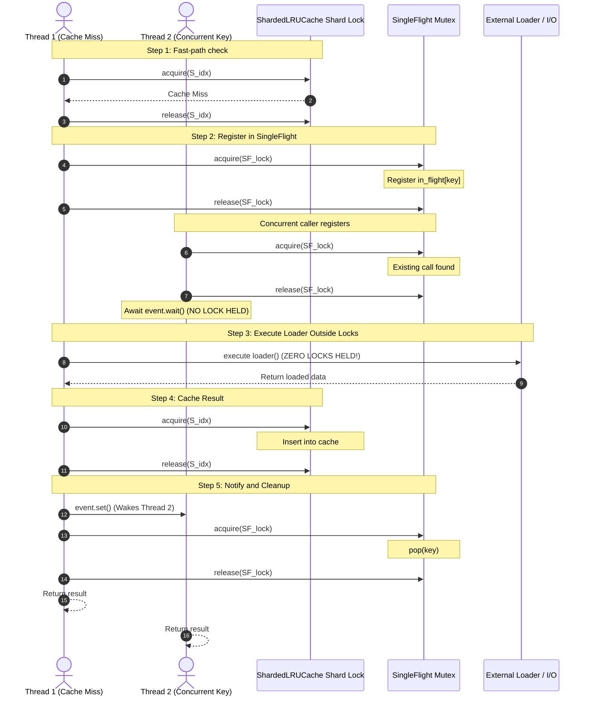

# Phase 2: System Architecture & Technical Design Document (Audited & Hardened)

## 1. System Overview

The Resume Screening Platform is engineered as a two-tier dual-purpose architecture:
1. **The Graded Core Submission (`submission/`)**: A clean, zero-dependency CLI + minimal ASGI service satisfying the take-home brief ("no database, no deployment, don't over-engineer").
2. **The Advanced Platform Layer (`src/screener/`)**: A high-concurrency, lock-striped, rate-limited, and memory-bounded enterprise platform designed for technical architecture walkthroughs.

```
+---------------------------------------------------------------------------------------+
|                                    CLIENT INGRESS                                     |
|              CLI (main.py)              OR             FastAPI (HTTP / JSON)          |
+---------------------------------------------------------------------------------------+
                                           |
                                           v
+---------------------------------------------------------------------------------------+
|                               RATE LIMITING INGRESS (A10)                             |
|  - Inbound TokenBucket: per client IP / API token                                     |
|  - Headers: RFC 6585 (X-RateLimit-Limit, Remaining, Reset)                             |
|  - Upstream OutboundLimiter: Adaptive epoch-based pause on x-ratelimit-reset            |
+---------------------------------------------------------------------------------------+
                                           |
                                           v
+---------------------------------------------------------------------------------------+
|                                JOB ORCHESTRATION LAYER                                |
|  - Bounded asyncio.Queue (backpressure: 503 + Retry-After: 30)                        |
|  - GIL-Aware WorkerRuntime:                                                           |
|      * ProcessPoolExecutor: CPU-bound parsing & TF-IDF vectorization                  |
|      * asyncio: Non-blocking HTTP I/O (GitHub API)                                    |
|      * ThreadPoolExecutor: Disk I/O & atomic persistence                             |
+---------------------------------------------------------------------------------------+
                                           |
                                           v
+---------------------------------------------------------------------------------------+
|                           CONCURRENT CACHING LAYER (A2, A3)                           |
|  - ShardedLRUCache (16 Shards, Lock Striping, O(1) DLL + Hash)                        |
|  - SingleFlight: Strict 2-phase coordination (Zero locks held during loader I/O)      |
|  - Segmented LRU (Probationary 20% / Protected 80%) + Min-Heap TTL                    |
+---------------------------------------------------------------------------------------+
                                           |
                                           v
+---------------------------------------------------------------------------------------+
|                            RUNTIME MEMORY GUARD (A4)                                  |
|  - Cross-platform RSS tracking (Linux /proc/statm, macOS Darwin bytes, Windows)       |
|  - Hysteresis Eviction: High Watermark (80%) -> Low Watermark (60%)                   |
+---------------------------------------------------------------------------------------+
```

---

## 2. Hardened Concurrency & Lock-Free Loader Architecture (A2, A3)

### 2.1 Single-Flight Lock-Free Coordination Pattern
Previous implementations risked deadlocks or lock corruption by releasing and re-acquiring locks inside context managers (`with self._lock:`). The hardened design implements a strict **3-Phase Registration and Notification Lifecycle**:

```
[Phase 1: Registration under Mutex]
  Thread acquires SingleFlight._lock
  If key in calls:
      Extract call.event
      Release SingleFlight._lock
      -> Go to Phase 2 (Wait outside lock)
  Else:
      Create new Call(event)
      Register in calls[key]
      Release SingleFlight._lock
      -> Go to Phase 3 (Execute Loader outside lock)

[Phase 2: Wait Outside Lock]
  Call event.wait() (NO LOCKS HELD)
  Re-raise call.err or return call.val

[Phase 3: Loader Execution & Notification]
  val = loader() (NO LOCKS HELD across network/disk I/O)
  call.val = val
  call.event.set() (Unblocks all waiting Phase 2 threads)
  Thread re-acquires SingleFlight._lock
  Remove calls.pop(key)
  Release SingleFlight._lock
  Return val
```

### 2.2 Strict Lock Hierarchy & Deadlock Freedom (A2)

To mathematically prove deadlock freedom, locks must be acquired strictly in ascending rank:

$$\text{Rank 1: SingleFlight Mutex} \implies \text{Rank 2: Shard Mutex } S_i \implies \text{Rank 3: TokenBucket Mutex}$$

**Invariants:**
1. **No Multiple Shard Acquisition**: A thread is structurally forbidden from acquiring $S_j$ while holding $S_i$ ($i \ne j$).
2. **Lock-Free Loader Invariant**: When `get_or_load(key, loader)` runs, `loader()` is strictly executed when holding **0** shard locks and **0** SingleFlight mutexes.
3. **Sequential Traversal Invariant**: When `MemoryGuard` or `sweep_expired()` traverses shards, locks are acquired and released strictly sequentially:
   $$\text{acquire}(S_0) \to \text{evict} \to \text{release}(S_0) \to \text{acquire}(S_1) \to \text{evict} \to \text{release}(S_1) \dots$$



---

## 3. Cross-Platform Memory Management (A4)

`MemoryGuard` relies on accurate Resident Set Size (RSS) telemetry to trigger its $80\% \to 60\%$ hysteresis eviction cycle. To guarantee fault-tolerant execution across host operating systems:

```python
def get_process_rss_mb() -> float:
    # 1. psutil (most accurate cross-platform if installed)
    if psutil is not None:
        try:
            return float(psutil.Process().memory_info().rss) / (1024.0 * 1024.0)
        except Exception:
            pass

    # 2. Linux /proc virtual filesystem
    if sys.platform.startswith("linux"):
        try:
            with open("/proc/self/statm", "r") as f:
                pages = int(f.read().split()[1])
            return float(pages * os.sysconf("SC_PAGE_SIZE")) / (1024.0 * 1024.0)
        except Exception:
            pass

    # 3. POSIX resource module with platform-specific units
    if resource is not None:
        try:
            raw_rss = float(resource.getrusage(resource.RUSAGE_SELF).ru_maxrss)
            if sys.platform == "darwin":
                # macOS Darwin returns ru_maxrss in bytes
                return raw_rss / (1024.0 * 1024.0)
            else:
                # Linux/BSD returns ru_maxrss in KiB
                return raw_rss / 1024.0
        except Exception:
            pass

    # 4. Fallback safe return
    return 0.0
```

---

## 4. Adaptive Upstream Quota Management (A10)

GitHub API allows only 60 unauthenticated requests/hour, emitting HTTP 403/429 with `x-ratelimit-remaining: 0` and `x-ratelimit-reset: <epoch_seconds>`.

### Design:
1. **Epoch Reset Math**:
   $$\text{wait\_s} = \max(0.0, \text{float}(\text{reset\_ts}) - \text{time.time()})$$
2. **Adaptive Pausing**: When quota is exhausted, `OutboundLimiter` sets `_paused_until = now + wait_s`, pausing subsequent requests while allowing currently enqueued batch operations to complete with `status="rate_limited"` instead of crashing.
3. **Graceful Pipeline Continuation**: If the rate limit is hit, candidate scoring proceeds with available local features; GitHub score receives a neutral default with `rate_limited` audit detail.

---

## 5. Dual Deliverable Packaging Strategy (A9)

The project will be structured into two cleanly separated packages:

### Deliverable A: Lean Graded Submission (`submission/`)
Meets the take-home brief without over-engineering:
```
submission/
├── main.py                  # Standalone CLI entrypoint
├── api.py                   # Minimal FastAPI (POST /screen, GET /results)
├── config.py, models.py     # Configuration and Pydantic schemas
├── parse.py, eligibility.py # Domain modules (byte-for-byte identical)
├── scoring.py, tfidf.py, lexicon.py
├── github_enrich.py         # Simple bounded enrichment
├── requirements.txt         # Minimal deps: fastapi, uvicorn, httpx, pydantic, pytest
├── results.json             # Golden baseline output
├── README.md                # Graded README: Setup, Run, Design Decisions, If I Had More Time
└── tests/                   # 20+ focused unit tests for parsing, eligibility, scoring, API
```
- **Reviewer Guarantee**: Can be run in `< 5 minutes` from a clean virtual environment without any platform-layer dependencies.

### Deliverable B: Advanced Platform Layer (`root` & `src/screener/`)
Showcase for senior technical walkthrough:
- Lock-striped `ShardedLRUCache`
- Two-tier GIL-aware `WorkerRuntime`
- Hysteresis `MemoryGuard` daemon
- Bounded backpressure `JobService`
- 73+ concurrency, property, and microbenchmark tests
- Comprehensive documentation (`docs/design.md`, `docs/runbook.md`, `docs/DEFENSE.md`, `docs/adr/`)
